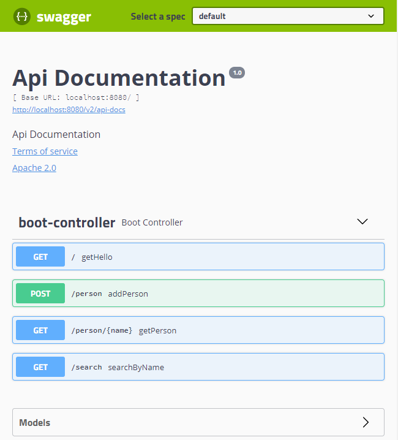
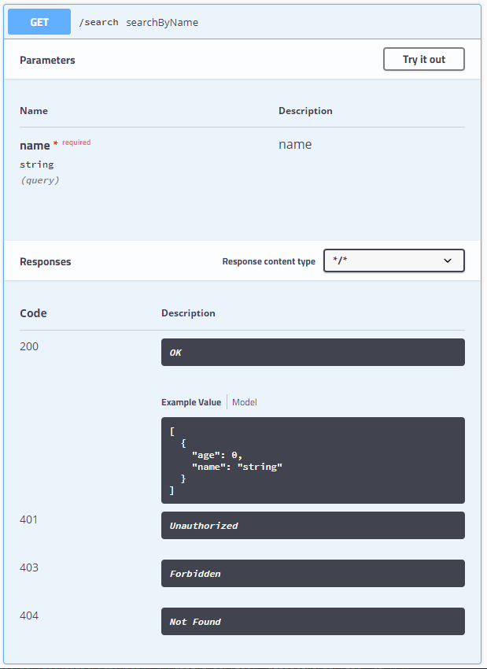

# Spring Boot Template - RESTful API

Simple Template for Spring __RESTfull Service__ with automatically generated(bottom-up approach) __Swagger UI__.
Please check the similar but, Top-to-bottom approach RESTful webservice [here](https://github.com/allthatjava/boot-example-rest-api2) to see how it can be implemented.

## Simple RESTful API
Only two services are included
* __/__ : will return one hard coded Hello object that includes "Hello~" and 99
* __/search/{name}__ : will return search results. (We have static names 'Bob', 'Will', and 'Barnie')

```java
	@GetMapping("/")
	public Hello getHello()
	{
		return new Hello("Hello~", 99);
	}
	
	@GetMapping("/search")
	public List<Person> searchByName(@RequestParam("name") String name){

		return service.searchPersonalInfo(name);
	}
```

## RESTful Service API by Swagger
To have automatically generated Swagger based on the provided service, the following dependencies are required

```
    compile('io.springfox:springfox-swagger2:2.9.2')        // To usw Swagger
    compile('io.springfox:springfox-swagger-ui:2.9.2')      // To show Swagger UI
```

Also, it requires some configuration

```java
@Configuration
@EnableSwagger2
public class SwaggerConfig extends WebMvcConfigurationSupport {
	@Bean
	public Docket productApi() {
		return new Docket(DocumentationType.SWAGGER_2).select()
				.apis(RequestHandlerSelectors
				.basePackage("brian.example.boot.rest.controller"))		// Where to look for the service
				.build();
	}

	@Override
	protected void addResourceHandlers(ResourceHandlerRegistry registry) {
		registry.addResourceHandler("swagger-ui.html")
					.addResourceLocations("classpath:/META-INF/resources/");
		registry.addResourceHandler("/webjars/**")
					.addResourceLocations("classpath:/META-INF/resources/webjars/");
	}
}

```

## How to run ##
You can use either IDE or Command line. For the command line, type the following command

```
./gradlew clean build bootRun
```

## Swagger UI ##
After start this application, the following url will display the screenshot below


[http://localhost:8080/swagger-ui.html](http://localhost:8080/swagger-ui.html)




#### How to use Swagger UI ####
You can open the each service by clicking and click on "Try it out" button. It will let you enter the parameters.
Then hit "Execute" button below. You will see the result below.


